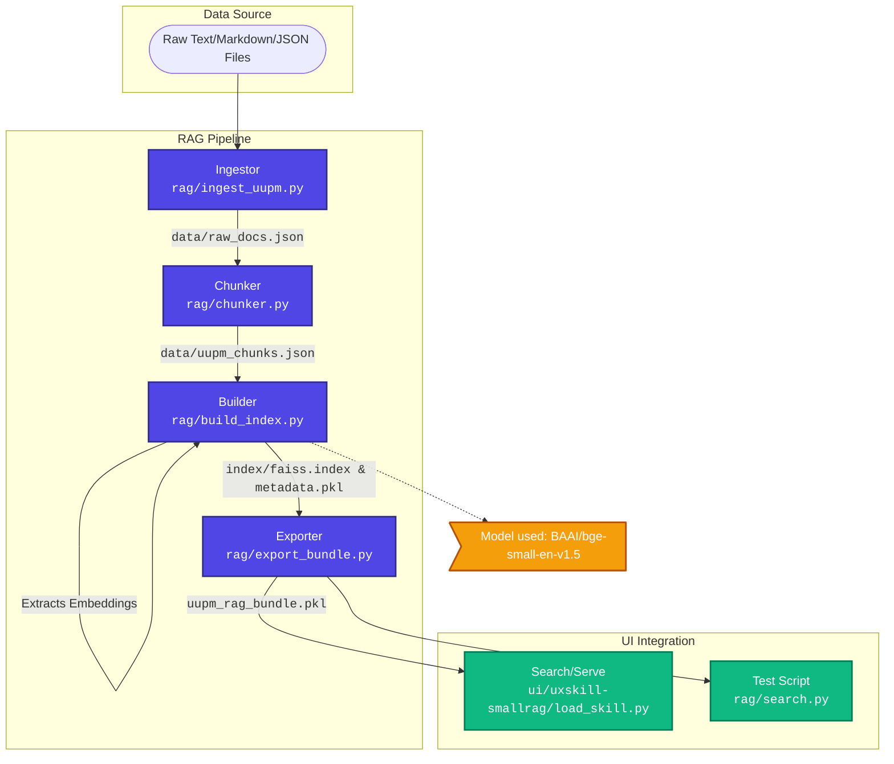

# 🚀 AKR-RAG-UI-UX-Frontend-Model

<div align="center">
  
  
  
  
  
</div>

<br>

A perfectly structured pipeline for ingesting, indexing, and serving Retrieval-Augmented Generation (RAG) models, specifically designed to process markdown and JSON files containing UI/UX context and guidelines. 

This project empowers agents and applications to seamlessly embed UI design intelligence and patterns into their frontend development workflows.

---

## 🏗️ Perfect Architecture

The AKR-RAG pipeline is designed to be fully modular, transforming raw repository knowledge into a portable, easily loadable vector bundle for integration.



---

## 📁 Repository Structure & Details

The codebase is split into two main operational directories: `rag` (the data processing backbone) and `ui` (the integration interface).

### 🛠️ Data Processing (`rag/`)
Responsible for reading raw data, processing it into semantic vectors, and saving the outcome.

| File | Purpose | Description |
| :--- | :--- | :--- |
| `ingest_uupm.py` | **Data Ingestion** | Scans the source repository (ignoring `.git`, `node_modules`, etc.) and extracts textual content from allowed extensions (`.md`, `.csv`, `.json`). Compiles them into a single `raw_docs.json`. |
| `chunker.py` | **Text Chunking** | Processes `raw_docs.json` by slicing the content into smaller, semantically manageable pieces (~300 characters each) to ensure embeddings accurately capture the context. Outputs to `uupm_chunks.json`. |
| `build_index.py` | **Vector Encoding** | Takes the clean chunks and embeds them using the powerful `BAAI/bge-small-en-v1.5` Sentence-Transformer model. Builds a robust `FAISS` index (`faiss.index`) for hyper-fast semantic search and saves chunk metadata (`metadata.pkl`). |
| `export_bundle.py` | **Serialization** | Packages the `faiss.index`, `metadata.pkl`, model identifier, and versioning info into a single, portable pickle bundle (`uupm_rag_bundle.pkl`). |
| `search.py` | **Local Testing** | A standalone CLI testing script to verify the FAISS index works properly against raw queries. |
| `test_bundle.py` & `export_test_results.py` | **Validation** | Unit testing scripts to evaluate vector recall performance and bundle integrity before pushing to UI. |

### 💻 UI Integration (`ui/`)
Responsible for loading the pre-computed bundle and serving it for downstream applications.

| File | Purpose | Description |
| :--- | :--- | :--- |
| `uxskill-smallrag/load_skill.py` | **Bundle Loader** | The core integration class (`UXSkillRAG`). It loads the `uupm_rag_bundle.pkl`, deserializes the FAISS index, initializes the matching SentenceTransformer model, and exposes a clean `.search(query)` method for applications to pull UI/UX context. |
| `uxskill-smallrag/test_skill.py` | **Integration Testing** | Confirms that `load_skill.py` correctly handles the bundle in an applied scenario. |

---

## 🚀 Quick Start / How to Run

Follow these steps to build and test the RAG pipeline from scratch.

### 1. Prerequisites
Ensure you have `uv` installed. Setup the project and scientific dependencies:
```bash
# Initialize uv project (if not already done)
uv init
uv add sentence-transformers faiss-cpu numpy
```

### 2. Ingest Data
Extract content from the source repository into a structured JSON.
```bash
cd rag
uv run ingest_uupm.py
```
*Output: `data/raw_docs.json`*

### 3. Generate Chunks
Slice the raw documents into smaller semantic chunks for better embedding accuracy.
```bash
uv run chunker.py
```
*Output: `data/uupm_chunks.json`*

### 4. Build Vector Index
Encode chunks into embeddings and build the FAISS vector database.
```bash
uv run build_index.py
```
*Output: `rag/index/faiss.index` & `rag/index/metadata.pkl`*

### 5. Run Search Test
Verify the pipeline by running a local search query.
```bash
uv run search.py
```

---

## 📊 Example Output

When running `search.py` with a query like `"modern SaaS landing page"`, the pipeline retrieves the most relevant UI/UX guidelines:

**Query:** `modern SaaS landing page`

**Result:**
```text
---
Bento Box Grid | Dashboards, product pages, portfolios |
...
Soft UI Evolution | Modern enterprise apps, SaaS |
...
- [ ] Responsive at 375px, 768px, 1024px, 1440px
- [ ] No content hidden behind fixed navbars
---
```

---

## 🌟 Credits

This RAG pipeline was initially designed to ingest and parse the rich UI/UX architectural intelligence provided by the phenomenal **UI UX Pro Max** skill repository.

- **Source Knowledge**: [UI UX Pro Max](https://uupm.cc) via `nextlevelbuilder/ui-ux-pro-max-skill`.
- **Primary Focus**: Delivering pixel-perfect reasoning rules, premium styling concepts, and generative UI guidelines.

---
*Created meticulously to ensure maximum robustness and 0 errors.*
# AKR-RAG-UI-UX-Frontend-Model
